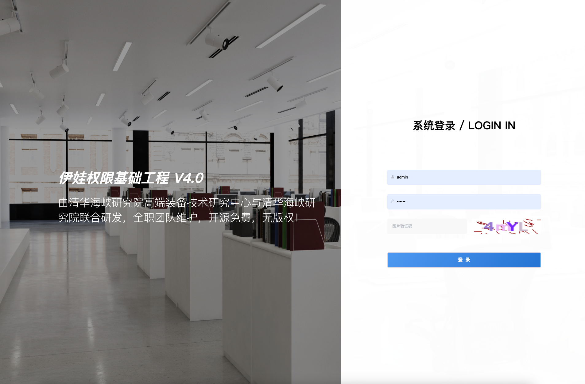
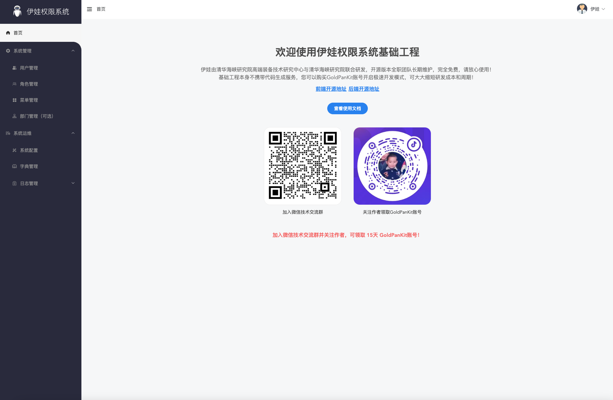
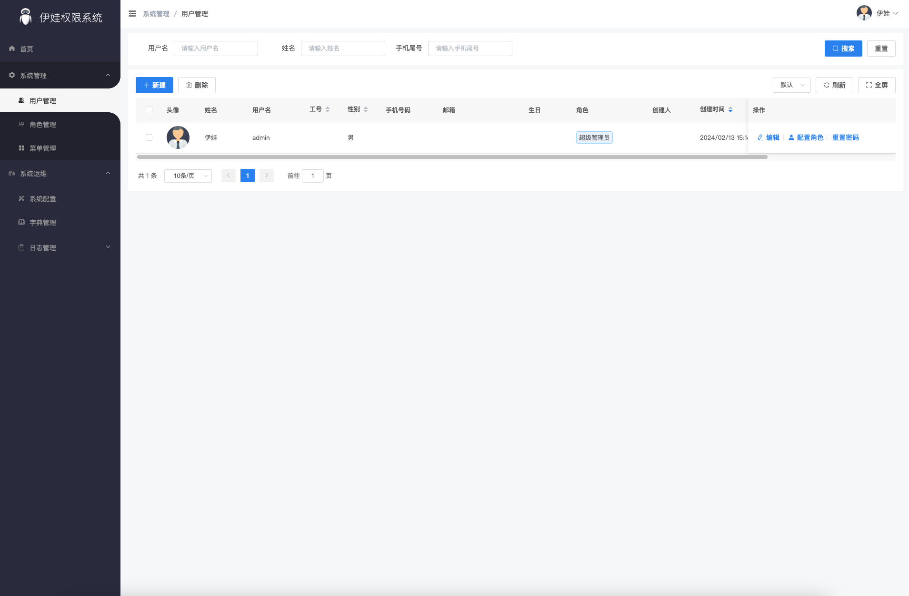
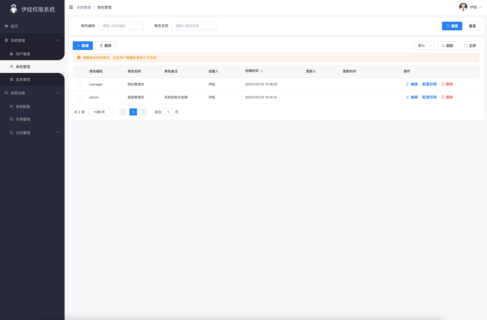
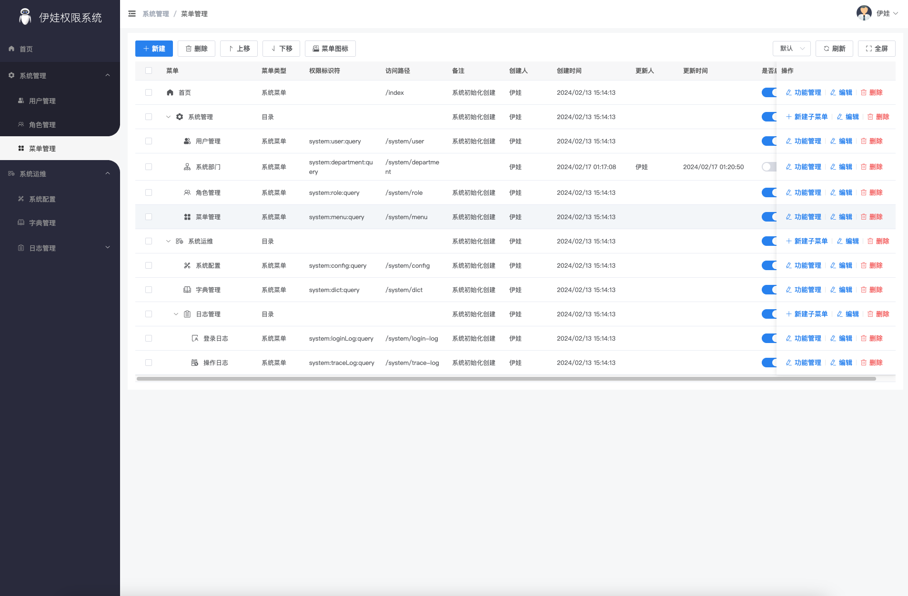
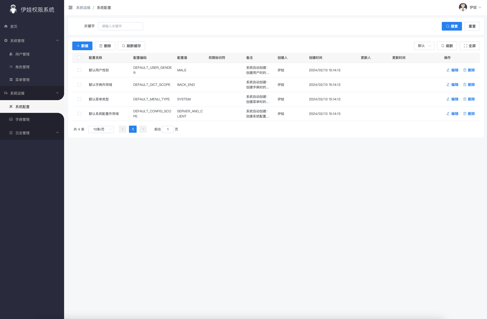
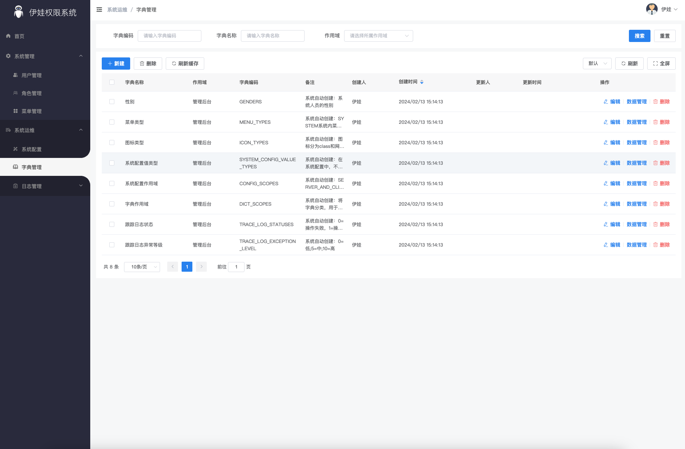
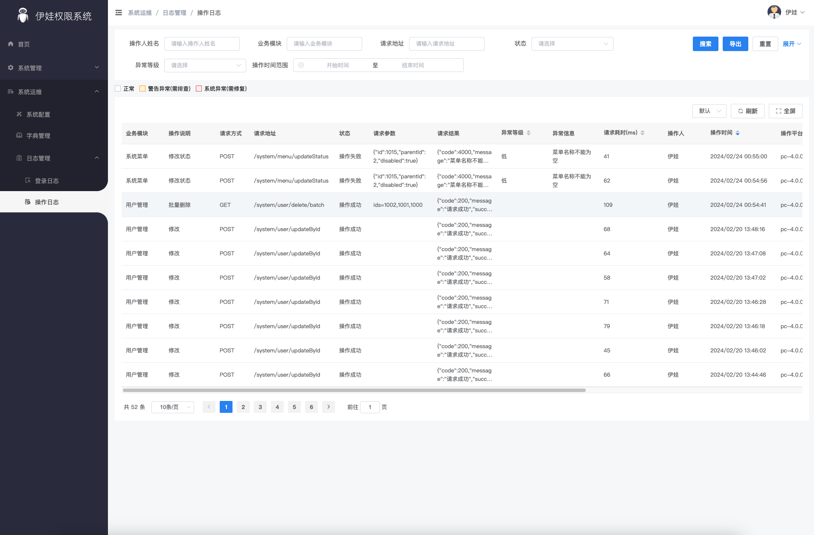
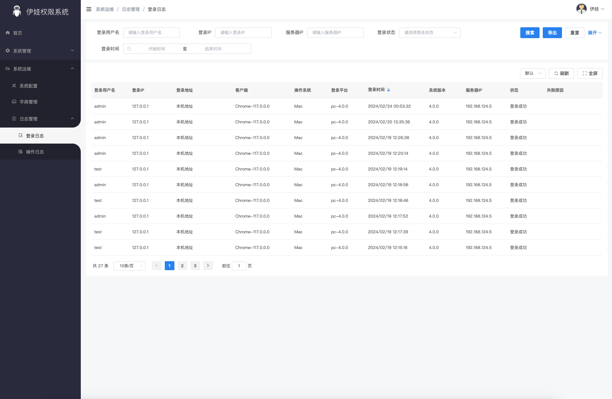

## 基础信息

本权限基础工程由清华海峡院高端装备技术研究中心与清华海峡院联合研发。旨在作为一套标准化的网站后台、内部系统的后端基础工程，可与其他Eva系的前端基础工程自由搭配来完成一整个项目的研发。

## 技术栈 & 版本信息
为了更容易让Vue2使用者上手，工程采用选项式开发，未来我们也会提供TS版。具体技术栈如下：
- 框架：Vue 3.4.21
- 编码风格：选项式
- UI库：Element-Plus 2.6.2
- 预编译：SASS 1.72.0
- 状态管理：Pinia 2.1.7
- 构建工具：Vite 5.2.0
- Node版本：v18.15.0
- Volta：支持

## 在线演示 & 技术文档
- 演示地址：http://online-v4.eva.adjustrd.com/
- 接口文档：http://online-v4.eva.adjustrd.com/api/doc/auth.html
- 技术文档：http://v4.eva.adjustrd.com/

超级管理员账号：admin/123123

## 项目特点
1. 可扩展的功能模块，默认情况下提供了用户管理、角色管理、菜单管理、字典管理、操作日志、登录日志模块，使用GoldPanKit可进一步进行源码级功能模块的扩展，如部门模块等。
2. 不用担心存在BUG，如果存在BUG，使用GoldPanKit可实现一键升级。
3. 不用担心存在安全漏洞，如果存在安全漏洞，GoldPanKit会进行提醒并支持一键升级。
4. 清华团队全职维护，无版权，可放心使用。
5. 规范化代码 + 详细的代码注释。
6. 合理封装，经过Eva3 8000+项目的实践经验，进行常用功能合理的封装。
7. 丰富的插件市场，可使用GoldPanKit进行单表、多表的页面生成。

## 绝对优势

结合GoldPanKit可实现代码直接生成到项目中，安装更多的功能模块，一键修复BUG等，是国内目前唯一一套技术栈可定制、功能模块可定制、代码生成分离和支持BUG一键修复的开源系统。

## 项目预览
**登录页**


**首页**


**用户管理**


**角色管理**


**菜单管理**


**系统配置**


**字典管理**


**操作日志**


**登录日志**


## 常见问题

#### Error: error:0308010C:digital envelope routines::unsupported
在执行`yarn serve`或`npm run serve`启动项目时，出现`Error: error:0308010C:digital envelope routines::unsupported`错误。说明当前node版本过高，node 17及以上，则会出现该问题，解决方法如下：

###### MAC
先执行以下命令
```
export NODE_OPTIONS=--openssl-legacy-provider
```
再执行`yarn serve`或`npm run serve`启动项目。

###### Windows
先执行以下命令
```
set NODE_OPTIONS=--openssl-legacy-provider
```
再执行`yarn serve`或`npm run serve`启动项目。
